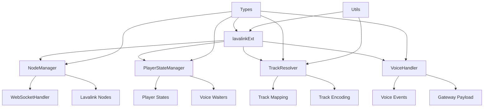
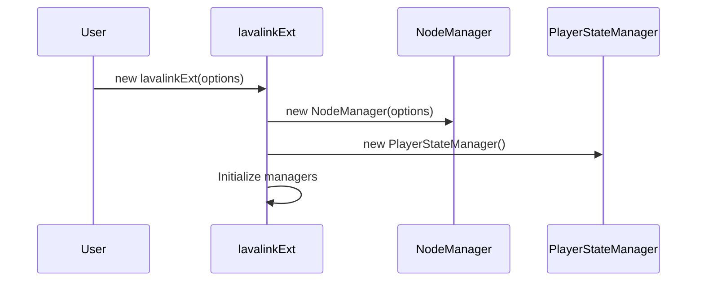
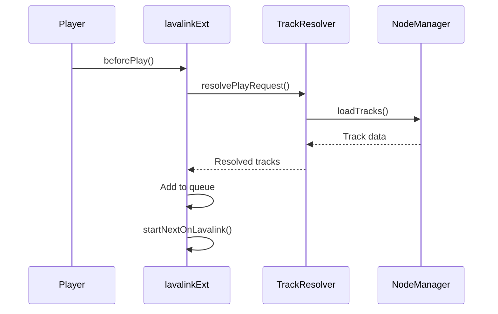
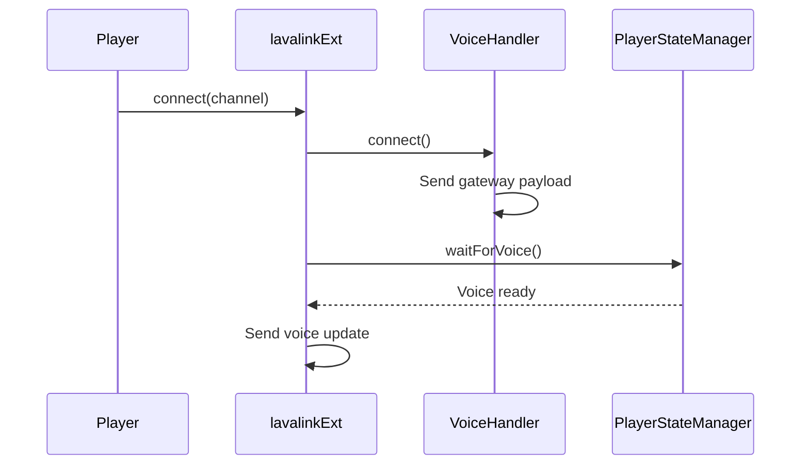

# Kiến trúc Module Lavalink Extension

## Sơ đồ kiến trúc

```mermaid
graph TB
    A[lavalinkExt] --> B[NodeManager]
    A --> C[PlayerStateManager]
    A --> D[TrackResolver]
    A --> E[VoiceHandler]

    B --> F[WebSocketHandler]
    B --> G[Lavalink Nodes]

    C --> H[Player States]
    C --> I[Voice Waiters]

    D --> J[Track Mapping]
    D --> K[Track Encoding]

    E --> L[Voice Events]
    E --> M[Gateway Payload]

    N[Types] --> A
    N --> B
    N --> C
    N --> D
    N --> E

    O[Utils] --> A
    O --> D
```

## Luồng hoạt động

### 1. Khởi tạo

```mermaid
sequenceDiagram
    participant U as User
    participant L as lavalinkExt
    participant N as NodeManager
    participant P as PlayerStateManager

    U->>L: new lavalinkExt(options)
    L->>N: new NodeManager(options)
    L->>P: new PlayerStateManager()
    L->>L: Initialize managers
```

### 2. Play Track

```mermaid
sequenceDiagram
    participant P as Player
    participant L as lavalinkExt
    participant T as TrackResolver
    participant N as NodeManager

    P->>L: beforePlay()
    L->>T: resolvePlayRequest()
    T->>N: loadTracks()
    N-->>T: Track data
    T-->>L: Resolved tracks
    L->>L: Add to queue
    L->>L: startNextOnLavalink()
```

### 3. Voice Connection

```mermaid
sequenceDiagram
    participant P as Player
    participant L as lavalinkExt
    participant V as VoiceHandler
    participant PS as PlayerStateManager

    P->>L: connect(channel)
    L->>V: connect()
    V->>V: Send gateway payload
    L->>PS: waitForVoice()
    PS-->>L: Voice ready
    L->>L: Send voice update
```

